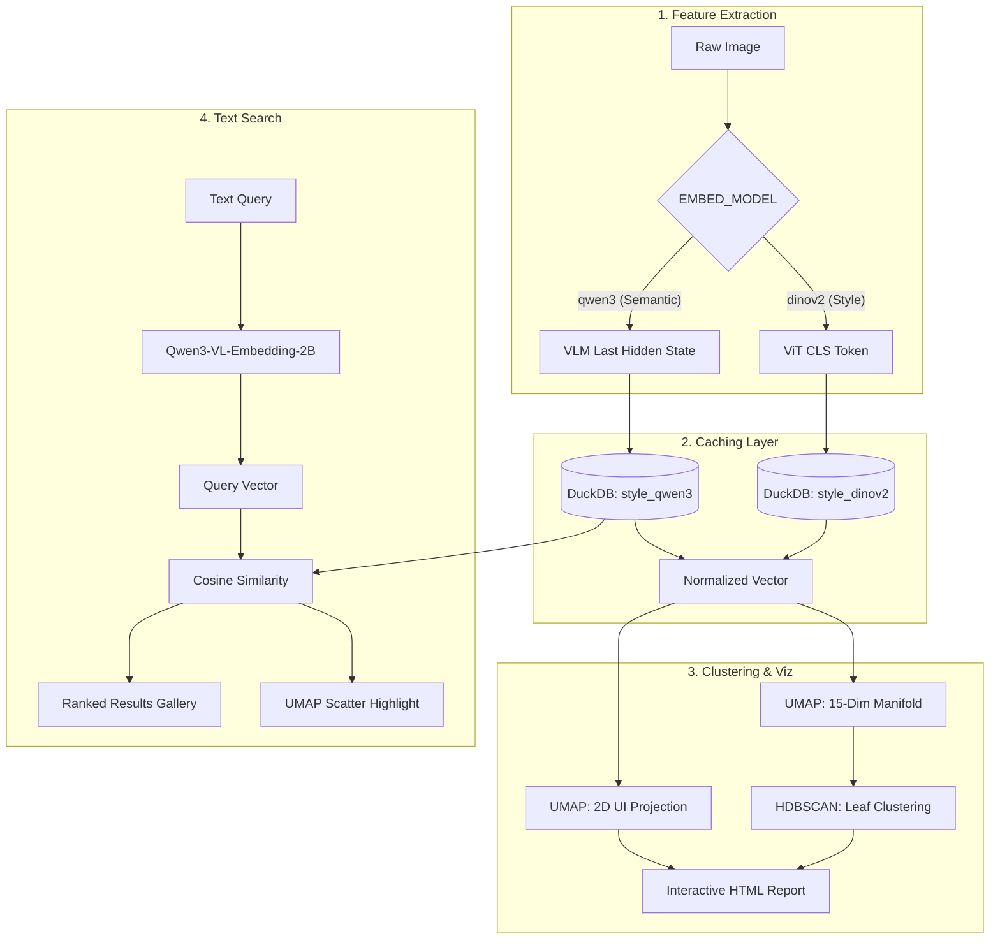

# Engineering Design: DINOv2 Aesthetic Clustering Pipeline

This document details the architecture and logic behind the style-centric clustering system. Unlike semantic search, this pipeline is designed to group images by their **artistic DNA**—tonal range, grain, lighting, and compositional structure.

---

## 1. High-Level Concepts

### A. Style vs. Semantics
*   **The Style Expert (DINOv2):** A self-supervised Vision Transformer (ViT). Because it was trained without text labels, it doesn't "know" what a dog is; it only knows patterns, textures, and geometric relationships. This makes it superior for grouping by *technique*.
*   **The Semantic Expert (Qwen3-VL):** A Vision-Language Model (VLM). It understands high-level concepts (e.g., "A street in Paris"). It is used when the goal is to group by *subject matter*.

### B. The Manifold Hypothesis
Artistic styles don't fit into neat boxes. They exist on a continuous spectrum. We treat the embedding space as a "Manifold"—a complex, curled-up shape in 1024-dimensional space—and use specialized math to flatten it and find density "islands" (clusters).

---

## 2. Architecture Overview

The pipeline operates in three distinct stages: Extraction, Distillation, and Discovery.



---

## 3. Engineering Deep Dive

### A. Embedding Normalization
The system uses `L2 Normalization` on all embeddings before storage. This shifts the distance metric from **Euclidean** (magnitude) to **Cosine Similarity** (angle), ensuring that image brightness or exposure doesn't disproportionately skew the artistic similarity.

### B. UMAP Hyperparameters
We use a two-step UMAP approach:
1.  **Clustering Manifold (15 Dimensions):** Reducing to 15 dimensions (rather than 2 or 50) provides HDBSCAN with enough "elbow room" to see density structures while stripping away the high-dimensional noise.
2.  **Visualization Manifold (2 Dimensions):** A separate projection used solely for the scatter plot UI.
3.  **Local Preservation:** `n_neighbors=8` is intentionally low to prioritize "Micro-Styles"—ensuring that very similar photos group tightly even if they are distinct from the rest of the library.

### C. HDBSCAN "Leaf" Selection
Standard HDBSCAN often merges clusters together. We use `cluster_selection_method='leaf'`. 
*   **Logic:** This forces the algorithm to pick the most granular, stable clusters at the bottom of the hierarchy tree.
*   **Result:** Instead of one giant "B&W" cluster, you get "High-Contrast Noir," "Grainy Film Scans," and "Soft Focus Tonalities" as distinct groups.

---

## 4. Persistent Caching (DuckDB)

To handle large libraries (1,000+ images) on consumer hardware, the system uses DuckDB:
*   **Photo ID:** SHA256 hash of the file header (fast, avoids re-processing moved files).
*   **Table Isolation:** `style_dinov2` and `style_qwen3` are stored separately, allowing users to switch models without invalidating the cache of the other.

---

## 5. Interactive Visualization Strategy

The pipeline generates a standalone `.html` report that embeds the entire gallery.
*   **Base64 Thumbnails:** All images are downsampled to 220px JPEGs and encoded as base64 strings directly in the HTML. This allows the report to be shared as a single file without a folder of images.
*   **CSS Custom Properties:** Dot colors are passed via `--cc` variables to minimize the DOM size.
*   **Canvas/SVG-Free:** The scatter plot uses absolute-positioned `` tags for high performance and native browser hover/zoom behavior.

---

## 6. Text Search

The pipeline includes an in-notebook text search feature built on top of the Qwen3-VL embedding space.

### How It Works
Because `Qwen3-VL-Embedding-2B` is a multimodal model, it accepts text-only inputs through the same chat template used for images, producing vectors in the same embedding space. A text query is therefore directly comparable to any image in `style_qwen3` via cosine similarity — no separate caption model or bridge embeddings required.

### Usage
Set `QUERY` and `TOP_N` in the `text_search` cell and run it:

```python
QUERY = "harsh backlight silhouette"
TOP_N = 8
```

Two outputs are produced:
- **Gallery:** Top-N matches ranked by similarity score.
- **UMAP Scatter:** All cluster dots rendered faintly; matching photos highlighted in gold. This reveals which visual-style clusters the semantically-matching photos belong to.

### Design Notes
- Search always reads from `style_qwen3` regardless of the active `EMBED_MODEL`. If you cluster with DINOv2, the Qwen3 embedding table is still populated independently — the two caches coexist.
- The model is loaded, used, and immediately freed to keep MPS memory available for subsequent cells.
- Query encoding uses the last hidden state token (index `-1`), matching the convention used during image embedding.

---

## 7. Resources & References

*   **[DINOv2: Learning Robust Visual Features](https://dinov2.metademolab.com/):** The foundational model documentation.
*   **[Understanding UMAP](https://pair-code.github.io/understanding-umap/):** Interactive guide on how the dimensionality reduction works.
*   **[HDBSCAN Leaf Selection](https://hdbscan.readthedocs.io/en/latest/parameter_selection.html):** Technical reasoning for granular clustering.

---

**Hardware Optimization:** This system is optimized for **Apple Silicon (MPS)**, utilizing `PYTORCH_MPS_HIGH_WATERMARK_RATIO` to manage unified memory during high-resolution ViT processing.
