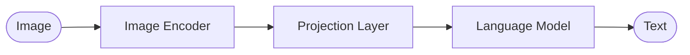

Vision Language Models (VLMs) can understand photos and text, and provide visual context, question/answer capabilities, and multimodal reasoning. 

**Multimodal reasoning** is the ability of an AI model to process and relate data across different modalities, such as text, images, audio, and video, simultaneously.

A typical VLM 

**Image Encoder:**  Extract visual context
**Projection Layer:** Align visual and textual representation.
**Language Model:** Process or generate text

## Fine Tuning
Fine-tuning a VLM means adapting a pre-trained model to your dataset or task. VLMs use the same tools and techniques for LLMs. However,  fine-tuning VLMs has additional challenges:

### 1. The Data Representation Challenge

In a text-only model, words are converted into numerical representations (**embeddings**) that the model can process. In a VLM, we have to do this for images too, but images don't have a natural "order" like sentences do.

- **Patching:** Most VLMs break an image down into smaller squares or "patches."
    
- **Flattening:** These patches are then turned into a sequence of numbers so the model can process them alongside text tokens. If this isn't done carefully, the model might lose track of where objects are located or how they relate to each other spatially.

**Note:** **Qwen2.5-VL** has an advantage with dynamic Patching: it uses native resolution, allowing the model to process images at any aspect ratio, such as 35mm 3:2, without distortion from traditional cropping to fit into squares.
    

### Performance on Leaderboards

Because of this high-resolution patching and dynamic scaling, Qwen models consistently rank near the top of the [OpenVLM Leaderboard](https://huggingface.co/spaces/opencompass/open_vlm_leaderboard). In the current rankings:

- **Qwen2-VL-72B** and its variants often outperform many proprietary models in document understanding and detail-heavy tasks.
    
- The **Qwen2.5-VL** series specifically improves on "learning to see" finer details, which would be highly beneficial for your 1TB library processing project, especially for generating those artistic descriptions and SEO tags.

### 2. Alignment (Mixing Oil and Water)

Ensuring the **Projection Layer** can translate visual numbers into the same mathematical space as text numbers.

- If the data representation is poor, the model might see a "dog" in the image but fail to connect it to the word "dog" in the text.
    

### 3. Scaling and Computational Cost

Images contain a massive amount of raw data compared to a few sentences of text. Preparing this data involves:

- **Resolution handling:** Deciding whether to shrink the image (losing detail) or keep it large (slowing down training).
    
- **Efficiency:** Using techniques like **PEFT (Parameter-Efficient Fine-Tuning)** or **Quantization** to manage the heavy memory requirements that come with processing high-resolution visual features.

## Resources
[Fine-Tuning Qwen2-VL-7B](https://huggingface.co/learn/cookbook/fine_tuning_vlm_trl)
