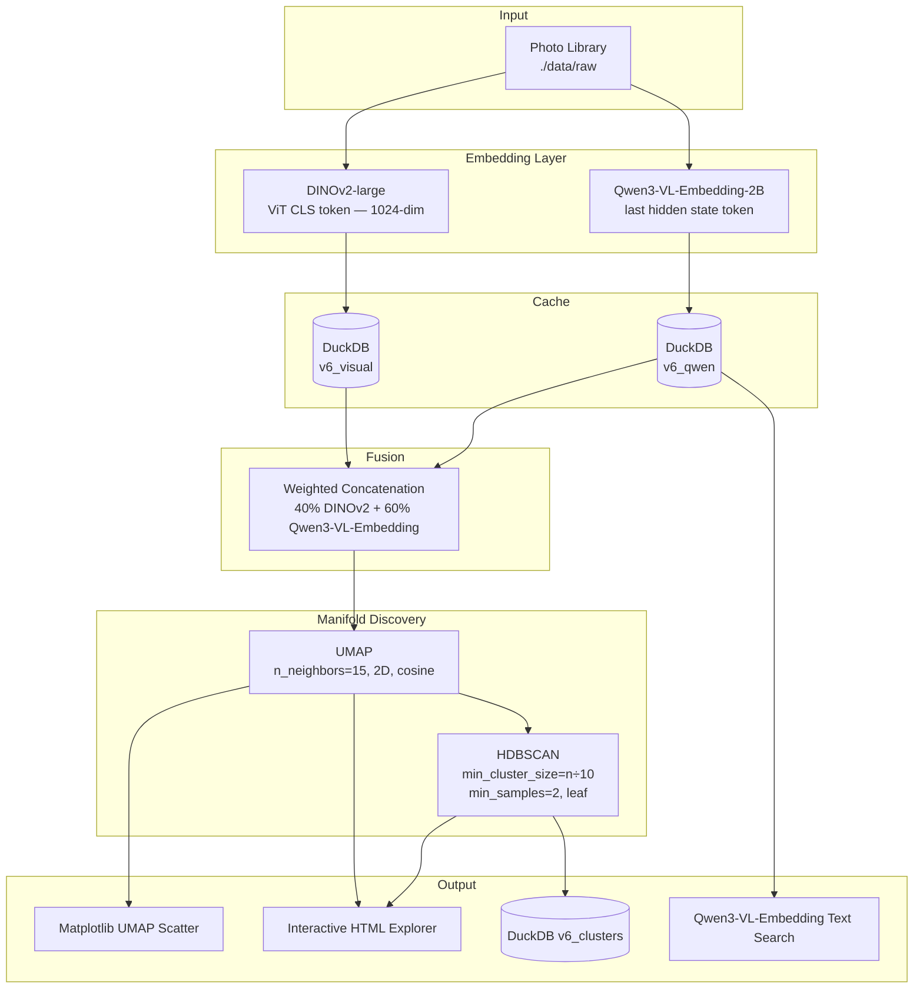
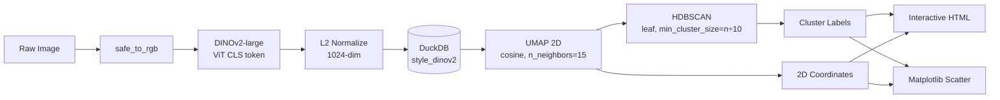
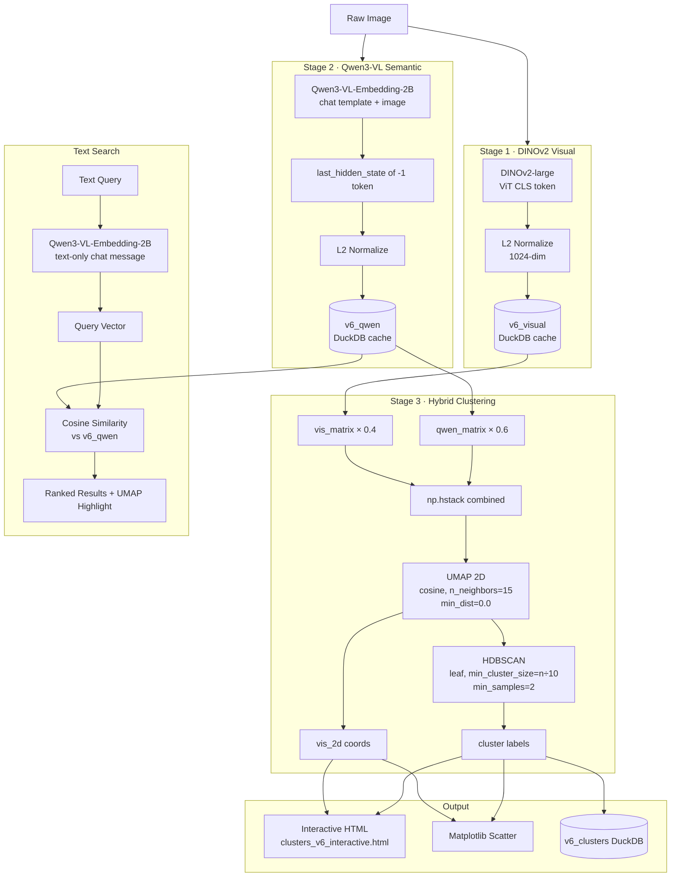

# Photo Clustering Pipeline — Architecture & Design

This document is the authoritative technical reference for the photo clustering system. It covers all three pipeline variants, their component architecture, data flows, clustering mathematics, and every tunable parameter.

---

## 1. Project Overview

The system enables a photographer to explore a large photo library by **visual style and artistic character** rather than by file name or date. Three pipeline variants exist, each trading off speed, semantic richness, and subject-awareness differently.

| Pipeline | Notebook | What groups together | Speed |
|---|---|---|---|
| **DINOv2** | `dinov2_clustering_pipeline.ipynb` | Same lighting, grain, tonal range, texture | ~15 img/s |
| **Qwen3-VL** | `qwen3_vl_pipeline.ipynb` | Same subject or scene content | ~0.3 img/s |
| **V6 Hybrid** | `similarity_search_v6.ipynb` | Subject + mood + style combined | ~0.3 img/s (Qwen3 gate) |

The V6 Hybrid is the recommended default for most use cases.

---

## 2. Technology Stack

| Component | Technology | Role |
|---|---|---|
| **Visual embeddings** | DINOv2-large (Facebook) | 1024-dim ViT CLS token — texture, grain, tonality |
| **Semantic embeddings** | Qwen3-VL-Embedding-2B (Alibaba) | Multimodal embedding model — images and text share the same vector space |
| **Dimensionality reduction** | UMAP | Flattens high-dimensional embeddings for clustering and visualization |
| **Clustering** | HDBSCAN (sklearn) | Density-based, no fixed K, auto-identifies outliers |
| **Cache / database** | DuckDB | Embedded SQL store for embeddings and cluster assignments |
| **Inference backend** | PyTorch + MPS | Apple Silicon GPU via Metal Performance Shaders |
| **Visualization** | Matplotlib + custom HTML | Scatter plot + interactive single-file HTML viewer |

---

## 3. System Architecture

### 3.1 High-Level Component Map



### 3.2 DINOv2-Only Pipeline (aesthetic mode)



### 3.3 V6 Hybrid Pipeline (full flow)



### 3.4 Caching Strategy

Every embedding computation is gated by a SHA-256 hash of the first 64 KB of the file. This means:

- Moving or renaming files does not invalidate the cache
- Re-running any stage skips photos already processed
- DINOv2 and Qwen3 embeddings live in separate tables and never cross-invalidate each other

```
photo_id = sha256(file[:64KB])[:16]
```

| Table | Contents | Invalidated by |
|---|---|---|
| `style_dinov2` | DINOv2-only pipeline embeddings | Never (append-only) |
| `style_qwen3` | Qwen3-only pipeline embeddings | Never (append-only) |
| `v6_visual` | V6 DINOv2 embeddings | Never (append-only) |
| `v6_qwen` | V6 Qwen3-VL-Embedding vectors | Never (append-only) |
| `v6_clusters` | Final cluster assignments | Recreated on each clustering run |

---

## 4. Clustering Deep Dive

### 4.1 The Manifold Hypothesis

Photo embeddings do not distribute randomly in 1024-dimensional space. They lie on a **manifold** — a lower-dimensional surface curled inside the high-dimensional space. Two photos that share dramatic side-lighting occupy nearby points on this manifold even if one is a portrait and one is architecture.

The pipeline's job is to:
1. **Flatten** the manifold into 2D (UMAP)
2. **Find density islands** on the flattened surface (HDBSCAN)

### 4.2 UMAP — Uniform Manifold Approximation and Projection

UMAP builds a weighted fuzzy graph of nearest-neighbor relationships in high-dimensional space, then optimizes a low-dimensional embedding that preserves the same topological structure.

**Why a single 2D pass (V6 design decision):**

An earlier version used a 15D intermediate pass for clustering and a separate 2D pass for visualization. This caused *cross-territory assignments* — a point could be assigned to cluster X in 15D but land visually inside cluster Y in the 2D scatter plot. The current design uses a single 2D pass for both, so cluster boundaries always match what is shown.

```
vis_2d = UMAP(2D).fit_transform(combined_embeddings)
reduced_embs = vis_2d   # same coords used for HDBSCAN and scatter
```

**What each UMAP parameter controls:**

| Parameter | Effect on low value | Effect on high value |
|---|---|---|
| `n_neighbors` | Preserves fine local structure; fragile on small datasets | Preserves global structure; more stable neighborhoods |
| `min_dist` | Points compressed into tight blobs | Points spread out; more even distribution |
| `metric` | — | cosine is preferred for normalized embeddings (angle = similarity) |

### 4.3 HDBSCAN — Hierarchical Density-Based Spatial Clustering

HDBSCAN converts pairwise distances into a *reachability graph*, builds a hierarchy of density levels (the condensed tree), and extracts stable clusters by pruning the tree.

**Key advantage over K-Means:** No fixed K required. Photos that don't belong to any dense group are labelled `-1` (noise/outliers) rather than force-assigned to the nearest cluster.

#### How the condensed tree works

```
High density ──► many small tight clusters (leaves)
Low density  ──► few large merged clusters (root)

cluster_selection_method='leaf'  → cut at the leaves (granular)
cluster_selection_method='eom'   → cut at max Excess of Mass (coarser)
```

`leaf` is used because it reveals distinct aesthetic sub-styles rather than one giant "similar looking" mega-cluster. `eom` was tested and produced only 2 clusters from 100 photos (over-merged).

#### Cluster label `-1` (noise)

Photos labelled `-1` are not failures — they are **genuinely unique** photos with no close aesthetic neighbors. They are displayed as their own "Outliers" group in the HTML viewer.

### 4.4 Why Not K-Means, DBSCAN, or Spectral?

| Algorithm | Why unsuitable |
|---|---|
| **K-Means** | Requires choosing K in advance; assumes spherical clusters; force-assigns all photos including genuine outliers |
| **DBSCAN** | Fixed density threshold `eps` — breaks when clusters have different internal densities (common in photo libraries) |
| **Spectral** | Builds an N×N similarity matrix; at 10,000 photos this is a 100M-element matrix that exhausts memory |
| **Agglomerative** | Good for dendrograms but merges are irreversible; sensitive to linkage criterion |

---

## 5. Parameter Tuning Reference

### 5.1 Global Config

| Parameter | Location | Default | Effect |
|---|---|---|---|
| `LIMIT` | setup cell | `'All'` | Set to an integer (e.g. `50`) to process a subset of photos. Useful for testing parameter changes without re-running full embedding. |
| `EMBED_MODEL` | setup cell (DINOv2 notebook) | `'dinov2'` | Switch between `'dinov2'` (aesthetic) and `'qwen3'` (semantic) in the single-model pipeline. |
| `VISUAL_WEIGHT` | setup cell (V6) | `0.4` | Weight given to DINOv2 embedding in concatenated vector. |
| `QWEN_WEIGHT` | setup cell (V6) | `0.6` | Weight given to Qwen3-VL-Embedding vector. Must sum to 1.0 with `VISUAL_WEIGHT`. |
| `QWEN_EMB_MODEL` | setup cell (V6) | `models/Qwen3-VL-Embedding-2B` | Path to the Qwen3-VL-Embedding-2B model weights. |

### 5.2 UMAP Parameters

Located in the **clustering cell** of each notebook.

| Parameter | Current value | Increase → | Decrease → |
|---|---|---|---|
| `n_neighbors` | `15` | More globally stable structure; larger, smoother clusters | Preserves fine local structure; fragile on small datasets (was `8`, caused orphan points) |
| `min_dist` | `0.0` | Points spread apart; density signal weakened for HDBSCAN | Points tightly packed; maximum density signal for HDBSCAN. `0.0` is optimal when the same 2D coords are used for clustering. |
| `metric` | `'cosine'` | — | Change to `'euclidean'` only if embeddings are not L2-normalized |
| `n_components` | `2` | Higher dims preserve more manifold structure but break the single-pass constraint | Lower dims lose information |
| `random_state` | `42` | Change to get a different but equally valid layout | Fixed seed for reproducibility |

**Tuning guidance:**
- For datasets under 200 photos: keep `n_neighbors` between 10–20
- For datasets over 500 photos: increase `n_neighbors` to 20–30
- If the scatter plot looks like a single undifferentiated blob: decrease `n_neighbors`
- If the scatter plot has many tiny isolated islands: increase `n_neighbors`

### 5.3 HDBSCAN Parameters

Located in the **clustering cell**, immediately after the UMAP block.

| Parameter | Current value | Increase → | Decrease → |
|---|---|---|---|
| `min_cluster_size` | `max(5, n // 10)` | Fewer, larger clusters | More, smaller clusters (original `n//15` gave 10 clusters from 100 photos) |
| `min_samples` | `2` | Stricter core-point requirement; more points become noise | More permissive; borderline points get force-assigned (original `1` caused orphan stray points) |
| `cluster_selection_method` | `'leaf'` | — `'eom'` merges sub-clusters aggressively; produced only 2 clusters from 100 photos | — `'leaf'` gives granular cuts |
| `metric` | `'euclidean'` | — | Only relevant in the UMAP-reduced space; do not change to cosine here |

**Practical tuning guide:**

```
Getting too many clusters (>8 for 100 photos)?
  → Increase min_cluster_size: n//10 → n//8
  → Or try cluster_selection_method='eom' (careful: may over-merge)

Getting too few clusters (1–2 for 100 photos)?
  → Decrease min_cluster_size: n//10 → n//12
  → Ensure cluster_selection_method='leaf' (not 'eom')

Getting stray orphan points in wrong cluster territories?
  → Increase min_samples: 2 → 3
  → Verify single 2D UMAP pass is active (vis_2d = reduced_embs)

Getting too many noise points (label = -1)?
  → Decrease min_samples: 2 → 1
  → Decrease min_cluster_size
```

**Formula reference for `min_cluster_size`:**

| Dataset size | `n//10` | `n//12` | `n//15` |
|---|---|---|---|
| 100 photos | 10 | 8 | 6 |
| 300 photos | 30 | 25 | 20 |
| 1000 photos | 100 | 83 | 66 |

### 5.4 Blend Weight Tuning (V6 only)

The `VISUAL_WEIGHT` / `QWEN_WEIGHT` ratio determines whether clusters are driven by **how the photo looks** or **what the photo depicts**.

| Ratio (Visual / Qwen) | Resulting cluster character |
|---|---|
| `0.4 / 0.6` (default) | Subject-aware with tonal sensitivity — portraits group together but also respect lighting |
| `0.6 / 0.4` | Tone and texture dominate — a dark portrait clusters with dark architecture |
| `0.2 / 0.8` | Strongly semantic — groups by scene type, nearly ignores visual texture |
| `1.0 / 0.0` | Identical to DINOv2-only pipeline |
| `0.0 / 1.0` | Pure Qwen3-VL-Embedding clustering |

After changing the weights, re-run from the **clustering cell** only — no need to re-embed.

### 5.5 Text Search Parameters

Located in the **text_search cell**.

| Parameter | Default | Notes |
|---|---|---|
| `QUERY` | `'solitary figure'` | Any natural language description of an aesthetic or subject |
| `TOP_N` | `6` | Number of results returned |

Query strings that work well with the Qwen3-VL-Embedding space (images and text share the same space natively):
- Lighting: `"harsh backlight silhouette"`, `"soft diffused window light"`, `"high contrast grain"`
- Subject: `"solitary figure in crowd"`, `"portrait close up"`, `"empty street"`
- Mood: `"melancholy isolation"`, `"documentary tension"`, `"quiet contemplation"`

---

## 6. Interactive HTML Viewer

The pipeline exports a standalone `outputs/html/clusters_v6_interactive.html` file that contains the full photo library with no external dependencies.

### Architecture

```
HTML file
├── <style>            CSS layout, scatter dot styles, cluster panel
├── #scatter-wrap      900×560 container
│   └── #scatter-inner absolute-positioned  tags (one per photo)
│       └── each  renders as a 14px filled circle via CSS
│           hover: expands to 120px showing the actual photo
├── #cluster-panel     Appears below scatter on click; grid of all cluster members
├── #lightbox          Full-screen photo viewer on grid click
└── <script>           
    ├── loads base64 thumbnails from clusterImages JSON
    ├── click → showCluster() fills #cluster-panel
    ├── wheel zoom (scale + translate via CSS transform)
    └── mousedown/move pan
```

### Performance design decisions

- **No Canvas or SVG**: The scatter uses absolute-positioned `` tags. Browser GPU compositing handles 100+ dots natively; no rendering library needed.
- **Base64 thumbnails**: All images are downsampled to 220px JPEG and embedded as base64 strings. The file is self-contained and shareable without a companion folder.
- **CSS custom property `--cc`**: Cluster color is passed as a CSS variable on each `` element rather than as a `style="background: #..."` attribute, keeping DOM size minimal.

---

## 7. Memory Management on Apple Silicon

Both models (DINOv2, Qwen3-VL-Embedding) are loaded, used, and explicitly freed between stages. This is necessary because the M4 Pro's 24 GB unified memory is shared between CPU, GPU, and the OS.

```python
del model
torch.mps.empty_cache()
gc.collect()
```

`PYTORCH_MPS_HIGH_WATERMARK_RATIO = "0.0"` forces the MPS driver to release memory immediately after each allocation rather than holding it speculatively. Without this, loading Qwen3-VL-Embedding-2B after DINOv2 can trigger an out-of-memory crash.

**Stage memory footprint (V6):**

| Stage | Peak MPS usage |
|---|---|
| Stage 1 — DINOv2-large | ~2.5 GB |
| Stage 2 — Qwen3-VL-Embedding-2B (float16) | ~4.0 GB |
| Stage 3 — UMAP + HDBSCAN (CPU) | ~0.5 GB |

---

## 8. Choosing the Right Pipeline

```
Goal: Group by tonal mood, lighting, grain, texture
  → dinov2_clustering_pipeline.ipynb
  → Fast, pure aesthetic signal
  → Portraits scatter across clusters (expected behaviour)

Goal: Group by subject/scene type
  → qwen3_vl_pipeline.ipynb  (set EMBED_MODEL = 'qwen3')
  → Slow, semantically rich
  → Portraits stay together regardless of lighting

Goal: Group by subject AND respect style
  → similarity_search_v6.ipynb
  → 40% DINOv2 + 60% Qwen3-VL-Embedding (direct image vectors)
  → Best results, requires two model stages only
  → Tune VISUAL_WEIGHT / QWEN_WEIGHT to shift the balance
  → Text search uses the same Qwen3-VL-Embedding model (no bridge needed)
```

---

## 9. Resources

- [DINOv2 — Learning Robust Visual Features without Supervision](https://dinov2.metademolab.com/)
- [Understanding UMAP (interactive guide)](https://pair-code.github.io/understanding-umap/)
- [HDBSCAN Parameter Selection](https://hdbscan.readthedocs.io/en/latest/parameter_selection.html)
- [Qwen3-VL Technical Report](https://qwenlm.github.io/blog/qwen3-vl/)
- [Curse of Dimensionality](https://en.wikipedia.org/wiki/Curse_of_dimensionality)
