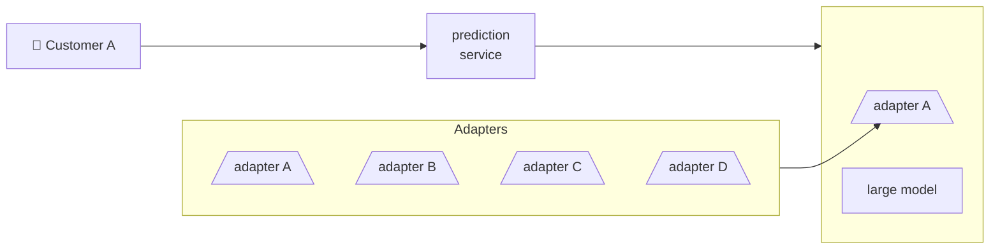

## What is Supervised Fine-Tuning?

SFT is the process of continuing to train a pre-trained model on task-specific datasets with labeled examples. Think of it as specialized education on artistic photography:

- Pre-training teaches the model general language understanding (like learning to read an image).
- Supervised fine-tuning teaches specific skills and behaviors (such as performing a specific task, like identifying artistic style).

In SFT, we’re not teaching the model new knowledge from scratch. Instead, we’re **reshaping how existing knowledge is applied**. The pre-trained model already understands language and grammar and has absorbed vast amounts of factual information. SFT focuses this general capability toward specific application patterns, response styles, and task-specific requirements.

This approach requires significantly less computational resources than training from scratch. The model learns to recognize instruction patterns, maintain conversation context, follow safety guidelines, and generate responses in desired formats.

### Fine-Tuning Mechanisms 

**Behavioral Adaptation**
Instruction tuning primarily affects the model’s surface-level behavior rather than its underlying knowledge. The model learns to recognize instruction patterns and respond appropriately. So basically, it will influence how the model focuses on certain instructions or tasks (e.g., what the artistic style of an image is) and shape the output accordingly (e.g., provide a curator description). However, most of the model knowledge comes from pre-training, not fine-tuning.

**Task Specialization**: Rather than learning entirely new concepts, the model learns to apply its existing knowledge in specific contexts. This is why SFT is much more efficient than pre-training.

**Safety Alignment**: Through exposure to carefully curated examples, the model learns to be more helpful, harmless, and honest. This involves both learning what to say and what not to say in various situations. For example, tell the model to remain a person rather than to identify gender or pronoun based on an image alone. 

### When to Use Supervised Fine-Tuning

The key question is: “Does my use case require behavior that differs significantly from general-purpose conversation?” If yes, SFT is likely beneficial.

Decision framework: Use this checklist to determine if SFT is appropriate for your project:

- Have you tried prompt engineering with existing instruction-tuned models?
- Do you need consistent output formats that prompting cannot achieve?
- Is your domain specialized enough that general models struggle?
- Do you have high-quality training data (at least 1,000 examples)?
- Do you have the computational resources for training and evaluation?

If you answered “yes” to most of these, SFT is likely worth pursuing.

### The SFT Process
#### Dataset Preparation and Selection

The quality of the training data is the most critical factor for successful SFT. Unlike pre-training, where quantity often matters most. Our dataset should contain input-output pairs that demonstrate exactly the behavior we want your model to learn.

Each training example should consist of:

1. **Input prompt**: The user’s instruction or question
2. **Expected response**: The ideal assistant response
3. **Context** (optional): Any additional information needed

Dataset size guidelines:

- Minimum: 1,000 high-quality examples for basic fine-tuning.
- Recommended: 10,000+ examples for robust performance.
- Quality over quantity: 1,000 well-curated examples often outperform 10,000 mediocre ones.

#### Monitoring and Evaluation

Effective monitoring is crucial for successful SFT. Unlike pre-training, where you primarily watch loss decrease, SFT requires careful attention to both quantitative metrics and qualitative outputs. The goal is to ensure the model is learning the desired behaviors without overfitting or developing unwanted patterns.

**Key Metrics to Monitor**:

**Training Loss**: Should decrease steadily but not too rapidly

- Healthy pattern: Smooth, gradual decrease.
- Warning signs: Sudden spikes, oscillations, or plateaus.
- Typical range: Starts around 2-4, should decrease to 0.5-1.5.

**Validation Loss**: Most important metric for preventing overfitting

- Should track training loss: A small gap indicates good generalization.
- Growing gap: Sign of overfitting; the model may be memorizing training data.
- Use for early stopping: Stop training when validation loss stops improving.

**Sample Outputs**: Regular qualitative checks are essential

- Generate responses: Test the model on held-out prompts during training.
- Check format consistency: Ensure the model follows desired response patterns.
- Monitor for degradation: Watch for repetitive or nonsensical outputs.

**Resource Usage**: Track GPU memory and training speed

- Memory spikes: May indicate batch size is too large.
- Slow training: Could suggest inefficient data loading or processing.

## LoRA and PEFT: Efficient Fine-Tuning

PEFT, or Parameter-Efficient Fine-Tuning, can improve an AI model without requiring a huge supercomputer.  Rather than retraining the entire model, we leave the original as is and train only a small additional part on top.

**LoRA, which stands for Low-Rank Adaptation,** is the most common kind of PEFT. It adds small adapters to the model’s layers. This is similar to adding a plugin to a large software program rather than changing the original code.

As a result, we can reduce the computer’s workload by 90% or more, and the model still performs almost as well as if you had retrained everything.

### Understanding LoRA
LoRA (Low-Rank Adaptation) is a parameter-efficient fine-tuning technique that freezes the pre-trained model weights and injects trainable rank decomposition matrices into the model’s layers. Instead of training all model parameters during fine-tuning, LoRA represents weight updates as low-rank matrices, significantly reducing the number of trainable parameters while maintaining model performance.  [LoRA paper](https://huggingface.co/papers/2106.09685).

LoRA is particularly useful for adapting large language models to specific tasks or domains while keeping resource requirements manageable.

### Loading LoRA Adapters

Adapters can be loaded onto a pre-trained model with load_adapter(), which is useful for trying out different adapters whose weights aren’t merged. Set the active adapter weights with the set_adapter() function. To return the base model, you could use unload() to remove all LoRA modules. This makes it easy to switch between different task-specific weights.

### Merging LoRA Adapters

After training with LoRA, you might want to merge the adapter weights back into the base model for easier deployment. This creates a single model with the combined weights, eliminating the need to load adapters separately during inference.