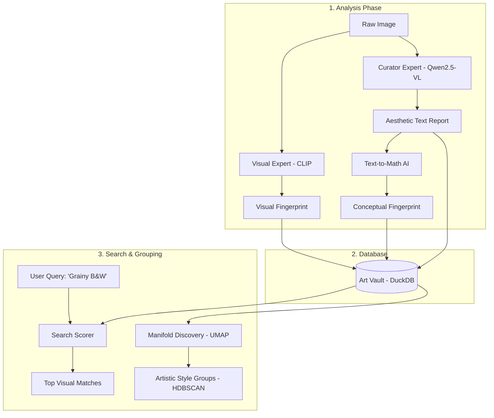

# Engineering Design: Style Similarity Search V4 (Hybrid AI)

This document explains the "Qwen-Maximized Hybrid" system. This is a sophisticated way of searching and grouping photos not just by their pixels (colors and shapes), but by their **artistic style and mood**.

---

## 1. High-Level Concepts (For Non-ML Audience)

To understand this system, it helps to understand three core ideas:

### A. What is an "Embedding"? (The Numeric Fingerprint)
Imagine every photo in your collection is assigned a unique set of GPS coordinates on a giant "Art Map." Photos with similar styles are placed close together on the map, while different styles are far apart. 
In AI, this "coordinate" is called an **Embedding**. It’s a long list of numbers that acts as a numeric fingerprint of the photo’s character.

### B. The Two "Opinions" (Visual vs. Conceptual)
This system uses two different AI "experts" to look at every photo:
1.  **The Visual Expert (CLIP):** This AI looks at raw geometry—lines, textures, and composition. It’s great at finding things that *look* alike (e.g., "Find another photo with a person in the center").
2.  **The Curator Expert (Qwen2.5-VL):** This AI "reads" the photo like a human art curator. It identifies things like "cinematic lighting," "minimalist tradition," or "melancholic mood." 

---

## 2. Architecture Overview

The diagram below shows how a photo moves through the pipeline to become a searchable "Artistic Fingerprint."

---

## 3. Engineering Deep Dive: Manifold Discovery & Clustering

In the V4 pipeline, we face a "High-Dimensionality Problem." Our hybrid vectors have 1536 dimensions. Traditional math breaks down in such high dimensions (the "Curse of Dimensionality"), making standard clustering like K-Means produce poor results. 

We solve this using **UMAP** for dimensionality reduction and **HDBSCAN** for cluster discovery.

### A. UMAP (Uniform Manifold Approximation and Projection)
**Logic:** UMAP assumes the data lies on a "manifold" (a lower-dimensional shape curled up in high-dimensional space). It builds a weighted fuzzy simplicial complex (a graph) and then finds a low-dimensional embedding that has the most similar topological structure.

*   **Pros:** Preserves both local and global structure; significantly faster than t-SNE.
*   **Cons:** Non-deterministic (results change slightly per run unless seeded); requires high-dimensional vectors to be normalized for best results.

### B. HDBSCAN (Hierarchical Density-Based Spatial Clustering)
**Logic:** HDBSCAN converts the data into a graph where edges represent "reachability distance." It builds a hierarchy of clusters and identifies "stable" clusters—those that persist across a wide range of density thresholds.

*   **Pros:** No need to specify $K$; identifies outliers as "Noise" ($Label = -1$); handles clusters of varying densities.
*   **Cons:** Computationally more expensive than K-Means; sensitive to the `min_cluster_size` parameter.

---

## 4. Evaluation of Alternative Approaches

If the UMAP + HDBSCAN pipeline isn't meeting specific requirements, engineers should consider these alternatives:

### 1. K-Means: The Centroid Partition
**The Logic:** K-Means attempts to partition $N$ observations into $K$ clusters in which each observation belongs to the cluster with the nearest mean (centroid).
*   **Best For:** When you have a fixed requirement (e.g., "I must have exactly 10 galleries") and your data is relatively uniform.
*   **Pros:** Extremely fast ($O(n)$); easy to explain to stakeholders.
*   **Cons:** Assumes clusters are "spherical" (convex). In art style, clusters are often elongated or complex. Crucially, **it forces every photo into a group**, even if the photo is stylistically unique, which pollutes your galleries with "junk" matches.

### 2. DBSCAN: Flat Density Discovery
**The Logic:** This is the predecessor to HDBSCAN. It defines clusters based on a fixed radius (`eps`) and a minimum number of neighbors.
*   **Best For:** Simple density-based discovery where all clusters have roughly the same "tightness."
*   **Pros:** Discovers arbitrary shapes; very fast on small-to-medium datasets.
*   **Cons:** **The Density-Gap Problem.** If one style (e.g., "Silhouettes") is very tight and another (e.g., "Street Portraits") is very loose, DBSCAN will either merge them into one giant group or ignore the loose group entirely.

### 3. Spectral Clustering: The Graph Manifold
**The Logic:** Uses the eigenvalues of the similarity matrix of the data to perform dimensionality reduction before clustering in fewer dimensions. It essentially finds the "cuts" in a graph that minimize the weight of edges between groups.
*   **Best For:** Small datasets with highly complex, non-convex manifolds that UMAP might struggle to flatten.
*   **Pros:** Mathematically elegant; excellent for "entangled" clusters.
*   **Cons:** **Memory Intensive.** It requires building an $N \times N$ similarity matrix. For 10,000 photos, this is a 100M element matrix, which can crash local environments.

### 4. Agglomerative (Hierarchical) Clustering
**The Logic:** A "bottom-up" approach where each photo starts in its own cluster, and pairs of clusters are merged as one moves up the hierarchy.
*   **Best For:** When you want to see how styles relate to each other (e.g., "The 'High Contrast' group is a sub-style of the 'Documentary' group").
*   **Pros:** Produces a dendrogram (a tree) which is great for hierarchical UI navigation.
*   **Cons:** Cannot undo a merge; sensitive to the "Linkage" criterion (Ward vs. Complete vs. Average).

---

## 5. How the "Hybrid Logic" Works

We use a **Weighted Score** to prioritize the "vibe" over the raw pixels:

**$Match Score = (Visual Match \times 40\%) + (Conceptual Match \times 60\%)$**

*   **Conceptual Weight (60%):** By favoring the Curator (Qwen), we ensure that the "Artistic Intent" is the primary driver for grouping.

---

## 6. Resources for Further Learning

*   **[Comparing Clustering Algorithms](https://scikit-learn.org/stable/modules/clustering.html):** A technical breakdown of when to use which algorithm.
*   **[Qwen2.5-VL Technical Blog](https://qwenlm.github.io/blog/qwen2.5-vl/):** Details on the "Curator AI" architecture.
*   **[The Curse of Dimensionality](https://en.wikipedia.org/wiki/Curse_of_dimensionality):** Why we need UMAP before clustering.

---

**Note:** This V4 system is currently optimized for the M4 Mac hardware, utilizing the **Unified Memory** of the Apple Silicon chip to run these heavy AI models efficiently.
